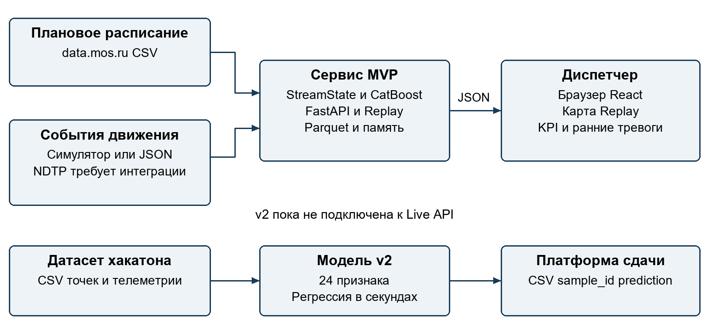
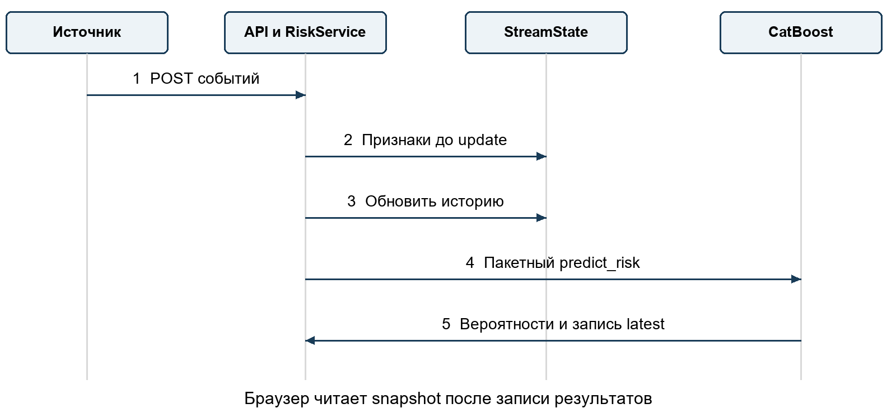
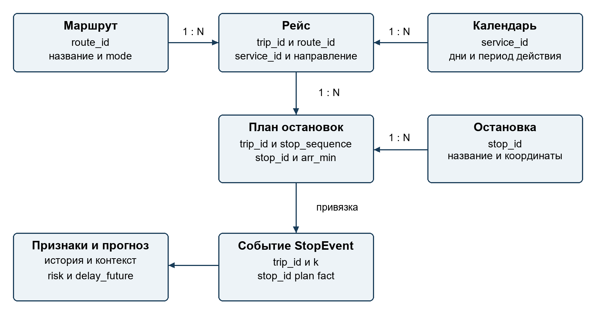

# 1 Обзор проекта

## Назначение и бизнес контекст

Предиктор задержек наземного транспорта предназначен для диспетчерской службы. Он сопоставляет плановое расписание с фактическим движением, оценивает риск опоздания и выделяет рейсы, которым может потребоваться внимание диспетчера. Бизнес-задача заказчика — получить предупреждение за 10–15 минут до нарушения графика, чтобы успеть оценить выпуск резерва, изменение движения или другие меры. Само принятие и исполнение таких решений остаётся за диспетчером.

В поставке реализованы веб-интерфейс, HTTP API, потоковый расчёт признаков, классификатор риска, регрессионная модель и воспроизведение записанного дня. Система имеет статус MVP. Демонстрационный контур использует реальное расписание Москвы и синтетическое фактическое движение. Отдельный пакет скриптов обрабатывает телеметрию хакатона и формирует CSV с прогнозом отклонения в секундах. Эти два контура используют разные наборы признаков и артефакты моделей.

Основные адресаты документа — технические представители заказчика, разработчики Backend и Frontend, ML-инженер, тестировщик и инженер эксплуатации. Разделы 1–2 описывают назначение и соответствие требованиям, 3–6 — устройство и контракты, 7–11 — разработку и эксплуатацию, 12–13 — организацию работ и действия пользователя.

## Версия и границы описания

Версия документа — 1.0 от 26 сентября 2026 года. Базовая версия исходного кода — ветка arhip, коммит 66535bcbcf06c203aff221f795a3f423bfe587d0. Описание относится к локальной поставке этой ревизии. Три рабочих артефакта delay_catboost.cbm, delay_regressor.cbm и hist_profile.pkl отличаются от Git-версии; их контрольные суммы сохранены в verification.json. Показатели из reports/metrics.json являются сохранённым отчётом обучения, а не результатом повторного обучения при подготовке документа.

В границы MVP входят импорт расписания CSV, обработка событий остановок, оценка риска, Replay и Live API, дашборд, скрипты обучения и автоматические проверки. Не входят автоматическое управление транспортом, производственная система идентификации пользователей, промышленный брокер телеметрии, долговременное хранение Live-состояния и гарантированная высокая доступность.

В этой ревизии decode_ndtp вызывает NotImplementedError. Реализованный GPS-адаптер ожидает уже декодированные отметки с trip_id. TCP/UDP-приёмник NDTP, Dockerfile и compose-конфигурация отсутствуют. Их нельзя считать частью готовой поставки только на основании архитектурной схемы в README. [S01, S02, S06]

## Цели и измеримые показатели

| Показатель | Назначение | Текущее подтверждение |
| --- | --- | --- |
| Горизонт 10–15 минут | Время для упреждающего решения | Требуется исправление выбора цели; подробности в разделе 2 |
| MAE будущего отклонения | Точность численного прогноза | 0,658 мин в сохранённом отчёте на синтетическом тесте |
| Precision при recall 70% | Полезность ранних тревог | 83,19% на синтетических примерах с текущей задержкой меньше 3 мин |
| Доступность основных HTTP-маршрутов | Готовность демо | Проверены GET API и статическая страница на локальных артефактах |
| Автоматические проверки | Защита от регрессий | Backend, frontend, build и Chromium smoke проходят |
| Качество на реальных данных | Пригодность для задачи заказчика | Нужен отдельный воспроизводимый отчёт; балл платформы не подтверждён документом |

Эти показатели нельзя смешивать: работоспособность интерфейса не доказывает качество прогноза, а качество на синтетике не является оценкой на реальном транспортном потоке. Для пилота целевые SLA и предельная задержка обработки должны быть согласованы отдельно.

## Пользователи и термины

Диспетчер просматривает риски и карточки рейсов. ML-инженер готовит данные, обучает и оценивает модели. Разработчик интеграции приводит внешний поток к каноническим событиям. Администратор запускает сервис, контролирует готовность артефактов и выполняет восстановление. Заказчик принимает результат по согласованным сценариям и критериям.

| Термин | Значение в проекте |
| --- | --- |
| ТС | Транспортное средство; в телеметрии хакатона идентифицируется tr_id |
| Рейс | Последовательность остановок конкретного выполнения маршрута; trip_id в MVP |
| StopEvent | Событие прохождения остановки с плановым и фактическим временем |
| Задержка | fact − plan; минуты в API MVP и секунды в выходе модели хакатона |
| Риск | Вероятность задержки не меньше 3 минут в целевой точке |
| Replay | Воспроизведение предварительно рассчитанного записанного дня |
| Live | Текущее состояние, накопленное из POST /api/events |
| NDTP | Формат телеметрии, требуемый заказчиком; байтовый декодер ещё не реализован |
| MAE | Средняя абсолютная ошибка прогноза, в единицах целевой переменной |
| PR AUC | В отчёте поле pr_auc содержит average precision из scikit-learn |
| SLI и SLO | Измеряемый показатель сервиса и его целевое значение |
| RTO и RPO | Целевое время восстановления и допустимая потеря данных |

# 2 Требования и критерии приёмки

## Правила трактовки требований

Требования заказчика взяты из предоставленного описания задачи хакатона: поток NDTP, прогноз на 10–15 минут, независимые модули Backend и ML, информативный диспетчерский интерфейс и обработка обрывов связи. Статус «реализовано» означает наличие соответствующего механизма в указанной ревизии; статус «частично» указывает конкретный недостающий элемент. Наличие теста является отдельным свидетельством и не подменяет проверку всей бизнес-функции.

В блоке общих рекомендаций заказчик одновременно использует слово «обязательна» для Docker-упаковки. До уточнения трактовки Docker следует включить в обязательный перечень подготовки к сдаче. PyTorch указан среди технологий, а GPU, ансамбли, ONNX/TensorRT и what-if — как рекомендации или дополнительные возможности. Текущая модель использует CatBoost на CPU; утверждать наличие нейросети или GPU-инференса оснований нет.

## Матрица соответствия требованиям заказчика

| ID | Требование | Статус | Свидетельство и условие приёмки |
| --- | --- | --- | --- |
| FR01 | Непрерывный приём и парсинг NDTP | Не реализовано | decode_ndtp — заглушка; нужен реальный поток, разбор пакетов и тест восстановления соединения |
| FR02 | Сопоставление телеметрии и расписания | Частично | pings_to_events работает по известному trip_id; восстановление рейса без trip_id отсутствует |
| FR03 | Очистка и производные признаки | Частично | 20 признаков StreamState и 24 признака v2; нет общей входной валидации потока и дедупликации |
| FR04 | Прогноз строго за 10–15 минут | Частично | H_TARGET=12,5, допускается цель до 20 мин по плану; требуется строгая проверка lead time |
| FR05 | Вероятность задержки | Реализовано в демо | DelayPredictor; требуется калибровка и оценка на реальных данных |
| FR06 | Численный прогноз и абсолютная ошибка | Частично | DelayRegressor, MAE и v2 CSV есть; численный прогноз не выведен в Live API и карточку |
| FR07 | Причина или паттерн сбоя | Частично | Признаки и медленные перегоны есть; нет отдельной причины, уверенности и рекомендации в Alert |
| FR08 | Сеть и положение ТС на карте | Частично | Replay показывает интерполяцию между остановками; Live-карта не отображается |
| FR09 | Цветовые уровни риска | Реализовано в Replay | Уровни 0, 1, 2 и отдельный уровень 3 без прогноза; пороги заданы сервером |
| FR10 | Полная карточка инцидента | Частично | Маршрут, остановка, текущая задержка и риск есть; будущая задержка и причина отсутствуют |
| AR01 | Независимые Backend и ML модули | Частично | Разделение пакетов есть; отдельные процессы и сетевой контракт ML не выделены |
| AR02 | Docker-упаковка | Не реализовано | Нужны Dockerfile, сборка, запуск с данными и smoke-проверка образа |
| DOC01 | Генерируемая документация и API | Реализовано для этой поставки | PyDoc code_reference.html, OpenAPI openapi.json, встроенный Swagger /docs |
| NF01 | Низкая задержка обработки | Проверено ограниченно | Есть локальный замер GET кадра; нагрузка и задержка event-to-screen не подтверждены |
| NF02 | Работа при обрыве телеметрии | Частично | Последние значения сохраняются; нет TTL Live-прогнозов, reconnect и явного индикатора устаревания |
| NF03 | Дообучение и масштабирование | Частично | Пакетное переобучение есть; Live хранится в одном процессе, worker-масштабирование небезопасно |
| NF04 | GPU и оптимизация инференса | Не реализовано | CPU CatBoost; решение о GPU принимается по профилю нагрузки |
| EX01 | Сложный map matching | Частично | Радиусный GPS-адаптер, расстояния и плановая цепочка; нет дорожного графа и NDTP-специфики |
| EX02 | What-if анализ | Не реализовано | Нужна модель сценариев и отдельный режим интерфейса |
| EX03 | Ансамбль и ONNX или TensorRT | Не реализовано | Дополнительная оптимизация после подтверждения базового качества |

## Проверка горизонта прогноза

StreamState выбирает первую остановку, для которой плановое время относительно текущей остановки не меньше 12,5 минуты. Прогноз пропускается, только если выбранная остановка лежит дальше 20 минут либо рейс заканчивается раньше. Значит, константа HORIZON_MIN=(10,15) сама по себе не гарантирует соответствия заказчику.

Проверка столбца ahead_plan_min в локальной тестовой выборке дала диапазон 13–20 минут: 672 873 из 687 662 примеров лежат в интервале 10–15 минут; 14 789 примеров, или 2,15%, превышают 15 минут. Это расстояние по плановому времени, а не доказанное время до будущего фактического события. При текущем опоздании отсчёт от времени поступления события fact даёт другой интервал. [S03, S15]

Критерий приёмки FR04: для каждого прогноза хранить issued_at и target_at, проверять интервал 600–900 секунд, считать долю корректных горизонтов и отдельно оценивать реальное опережение события. Для точек хакатона horizon_s уже вычисляется как target_time_begin − T, но диапазон в scripts/model_v2.py не ограничивается отдельной проверкой. Данные следует валидировать до обучения и инференса.

## Пользовательские сценарии и приёмочные проверки

| Сценарий | Действия | Критерий результата |
| --- | --- | --- |
| UC01 Начало смены | Открыть / и проверить готовность | Страница открылась; доступны сведения о дне и KPI; режим данных явно обозначен |
| UC02 Поиск риска | Выбрать автобус или трамвай, высокий риск, время пика | Карта фильтруется; ранние тревоги имеют риск ≥60% и текущую задержку <3 мин |
| UC03 Просмотр рейса | Нажать ТС или тревогу в Replay | Карточка показывает маршрут, остановку, риск и ближайшие плановые остановки |
| UC04 Приём событий | Передать корректную JSON-пачку в /api/events | API возвращает accepted и scored; риск появляется в /api/risk |
| UC05 Неготовые артефакты | Запустить API без replay-кэша | API жив, source.ready=false; Replay-маршруты возвращают 503 с подсказкой |
| UC06 Подготовка CSV | Запустить модель v2 на установленном датасете | Все sample_id шаблона имеют конечный прогноз в секундах, порядок и разделитель сохранены |
| UC07 Потеря связи | Прекратить поток и восстановить соединение | Целевой сценарий: возраст данных виден, сервис не падает, нет повторного учёта пакетов |

Приёмка включает все обязательные требования FR01–FR10 и согласованные архитектурные условия. Текущий smoke-тест подтверждает открытие основных элементов UC01 и успешные GET-запросы; действия выбора и фильтрации в UC02–UC03 целиком им не проверяются. UC06 не был выполнен в этой поставке: каталог data/hackathon локально отсутствует. UC07 требует реализации механизмов надёжности.

## Нефункциональные критерии пилота

Предлагаемые, ещё не утверждённые цели: API p95 до 200 мс для прогретых GET при согласованной нагрузке; p95 от приёма события до обновления Live-экрана до 5 секунд; доля 5xx ниже 0,1% при валидных входах; SLO доступности 99,5% за месяц пилота. Эти числа служат отправной точкой приёмочного протокола и не являются действующим SLA проекта.

В тестовом плане необходимо зафиксировать число ТС, частоту телеметрии, количество операторов, характеристики машины, продолжительность прогона и профиль пакетов. Проверки безопасности, нагрузки, восстановления и дрейфа данных имеют отдельные критерии. Отчёт содержит измерения, а не только отметку «пройдено».

# 3 Архитектура системы

## Контекст и границы системы

Контекстная схема показывает источники, пользователей и два существующих направления обработки. Подпись NDTP обозначает требуемую интеграцию. Диспетчерский дашборд работает через API; доступ браузера к данным на диске не предусмотрен.



Рисунок 1. Контекст MVP и граница будущей интеграции NDTP.

## Компоненты и контейнеры

| Компонент | Код и технология | Ответственность |
| --- | --- | --- |
| Домен | app/domain/schema.py | StopEvent, DayContext, RiskPrediction и ScheduleTables |
| Источники | app/data_sources | Импорт CSV, преобразование GPS, чтение и запись Parquet |
| Движок | app/engine | Одинаковый расчёт 20 признаков при обучении и онлайн |
| Модель | app/model | Обучение, оценка, сериализация CatBoost и загрузка артефактов |
| Сервисы | app/service | Live-состояние и готовые кадры Replay |
| HTTP API | app/api.py, FastAPI | Валидация входных моделей, маршрутизация и выдача JSON |
| Веб-клиент | web/src, React и TypeScript | Карта Canvas, панели, фильтры, воспроизведение и опрос API |
| Пакетный контур | run_all.sh и app/replay_build.py | Подготовка данных, обучение и серверный кэш дня |
| Контур хакатона | scripts/model_v2.py и telemetry_features.py | 24 признака, регрессия в секундах и CSV submission |

На уровне исполнения это браузер, один процесс Uvicorn с библиотекой CatBoost, отдельные пакетные Python-процессы и локальная файловая система. Слово «контейнер» в описании C4 обозначает исполняемый блок, а не наличие Docker. Сервиса БД, Redis, брокера сообщений и отдельного сетевого ML-сервиса в данной ревизии нет.

## Последовательность обработки Live



Рисунок 2. Порядок расчёта признаков, изменения состояния и публикации риска.

API принимает список Event. RiskService сортирует события по fact внутри одной пачки, пропускает неизвестные trip_id, вычисляет признаки до обновления StreamState и затем обновляет состояние. Для событий с целевой остановкой признаки объединяются в DataFrame и одним вызовом predict_risk передаются CatBoost. Последний прогноз каждого рейса сохраняется в _latest.

Это обеспечивает единый порядок признаков, но не транзакционность: состояние меняется до окончания обработки всей пачки и до завершения инференса. Ошибка посередине может оставить частично обновлённое состояние. Повтор пачки не является безопасной идемпотентной операцией. Глобальная упорядоченность между HTTP-запросами, блокировка конкурентных записей и журнал событий отсутствуют. [S03, S04]

## Конвейер Replay и вычисление кадра

run_all.sh последовательно преобразует CSV в Parquet, моделирует фактическое движение, проверяет GPS-адаптер, обучает модели, строит replay.pkl и собирает web/dist. Функция build выбирает день из тестовой части; по умолчанию это четвёртый доступный тестовый день. Если запрошенная дата не найдена, код выбирает запасной день, поэтому оператор проверяет поле date ответа /api/replay/day.

ReplayDay хранит плоские NumPy-массивы событий. Ключ сортировки равен индексу рейса, умноженному на 10 000, плюс fact. Для одного времени t NumPy searchsorted находит позиции по всем рейсам; границы trip_off отделяют записи соседних рейсов. Координаты линейно интерполируются между остановками, риск берётся из последнего события. Карта не показывает измеренную GPS-позицию в каждый момент.

KPI считаются по выбранному виду транспорта, а фильтр min_level влияет на отображаемые машины. Медленные перегоны вычисляются по всей сети за предыдущие 15 минут и не фильтруются по mode. Линия времени пересчитывает число рейсов высокого риска с шагом 5 минут. Доля сбывшихся ранних тревог использует прогнозы 20–30 минут назад и показывается только при наличии не менее пяти завершённых проверок. [S05]

## Интеграции и внешние зависимости

Расписание поступает из локальных выгрузок data.mos.ru; автоматического загрузчика и периодического обновления CSV нет. Погода и календарь представлены DayContext: rain задаётся симулятором либо POST /api/context, holiday — простым признаком. Комментарий Open-Meteo в README обозначает возможную замену, а не работающую интеграцию.

Основные Python-библиотеки — pandas, NumPy, PyArrow, scikit-learn, CatBoost, FastAPI и Uvicorn. Frontend использует React, TypeScript и Vite. Во время обычного просмотра готового Replay ML не переобучается: кадры используют заранее рассчитанный риск. Live вызывает классификатор при приёме новых событий.

## Архитектурные решения и альтернативы

| Решение | Обоснование в текущей реализации | Компромисс и условие пересмотра |
| --- | --- | --- |
| ADR01 Канонический StopEvent | Общий вход для симулятора, GPS и движка | Нужен адаптер NDTP и надёжная идентификация рейса |
| ADR02 Один StreamState | Уменьшает расхождение признаков обучения и Live | Порядок событий должен контролироваться; отдельный v2 пока использует другой код |
| ADR03 Parquet и pickle | Простая пакетная обработка и быстрый запуск демо | Нет транзакций, миграций и безопасного чтения недоверенного pickle |
| ADR04 In-memory Live | Небольшое число компонентов и быстрый доступ | Состояние теряется при рестарте; нужен внешний store для нескольких workers |
| ADR05 Кадр рассчитывается сервером | Общие пороги, KPI и одна карточка на запрос | Частый Replay-опрос нагружает API; нужны измерения при множестве клиентов |
| ADR06 CatBoost | Табличные признаки, NaN и небольшой контур инференса | Реальные метрики и калибровка требуют отдельной оценки |
| ADR07 Frontend выдаётся FastAPI | Один origin и простая локальная эксплуатация | Независимый CDN и отдельный ML-процесс потребуют иной схемы поставки |

Записи ADR01–ADR07 фиксируют принятый в коде способ построения системы; отдельного исторического журнала согласования ADR в репозитории нет. Redis/PostgreSQL и брокер событий — варианты для устойчивого потока; выделенный ML HTTP/gRPC-сервис — вариант независимого масштабирования. Нейросетевой ансамбль следует сравнивать с CatBoost на одинаковом временном разбиении, с учётом задержки и стоимости сопровождения.

# 4 Данные и машинное обучение

## Концептуальная модель



Рисунок 3. Логические связи расписания, событий и прогнозов. Связи поддерживаются кодом, а не внешними ключами СУБД.

Маршрут связан с рейсами, рейс — с календарём действия и последовательностью stop_times, остановка — с координатами. StopEvent добавляет фактическое время к прохождению остановки. Модель использует историю этого рейса, впереди идущих рейсов и перегонов. В API нет отдельной таблицы vehicles: идентификатор trip_id служит ключом текущего прогноза.

## Источники и схема хранения

| Объект | Ключевые поля | Локальный объём |
| --- | --- | --- |
| routes.parquet | route_id, route_short_name, route_type, mode | 49 маршрутов |
| stops.parquet | stop_id, stop_name, stop_lon, stop_lat | 1 636 остановок |
| trips.parquet | trip_id, route_id, service_id, direction_id | 28 537 рейсов расписания |
| stop_times.parquet | trip_id, stop_id, stop_sequence, arr_min | 627 164 записи |
| calendar.parquet | service_id, Monday…Sunday, start_date, end_date | 1 867 записей |
| fact/day=DATE.parquet | trip_id, route_id, direction_id, k, stop_id, plan, fact | 28 дней, 8 944 236 событий |
| sim_meta.parquet | date, rain, rain_from, rain_to, n_incidents | 28 записей |
| features_train_X и features_train_M | 20 признаков и метаданные цели | 825 528 примеров |
| features_test_X и features_test_M | 20 признаков и метаданные цели | 687 662 примера |
| replay.pkl | массивы ReplayDay | 20,12 МБ, 15 443 рейса за 3 сентября 2026 года |

Объёмы сняты с локальной поставки 26 сентября 2026 года. Рейсы расписания и рейсы конкретного дня — разные величины. Параметр N_ROUTES=40 не означает строго 40 маршрутов: адаптер добавляет до 10 трамвайных маршрутов; фактически получилось 49. [S06, S15]

CSV расписания выбираются по шаблону data-<номер>-*.csv из data/raw. Используются наборы 60664 — маршруты, 60662 — остановки, 60665 — рейсы, 60661 — остановочные времена, 60666 — календарь. Чтение выполняется с разделителем «;», пропуском второй строки заголовка и исходными строковыми типами. Выбор последнего имени файла лексикографический, поэтому оператор должен контролировать версии выгрузок.

Период симуляции — 10 августа–6 сентября 2026 года, seed=42. Симулятор добавляет часы пик, дождь, инциденты перегонов, увеличение посадки при нарушении интервала и частичное восстановление графика. Прогнозы на этих данных характеризуют поведение относительно механики симулятора.

## Время и правила валидации

plan, fact и t измеряются в минутах от полуночи служебных суток. Например, 08:00 — 480, а 26:15 — 1575. Значения больше 1440 допустимы. Отображаемые часы берутся по модулю 1440 и не передают дату. Автоматическая смена дня Live-состояния не реализована; dow и weekend задаются при создании RiskService. Переход суток должен сопровождаться управляемым сбросом либо сменой контекста в будущей реализации.

Event требует семь полей и проверяет базовые типы Pydantic. Диапазоны k, допустимые plan/fact, согласованность stop_id с расписанием, дубли и монотонность времени явно не валидируются. Неизвестный trip_id сервис пропускает без отдельной записи ошибки. Требуемое усиление: k в границах рейса, конечные числа, согласованный stop_id, единицы и дата, уникальный event_id, порядок события и причина отклонения.

GPS-адаптер использует радиус 60 м, приближённое расстояние с коэффициентом для широты Москвы и фиксированный порядок остановок. При пропусках промежуточные времена заполняются np.interp по индексам остановок между известными точками; это не интерполяция по реальной длине дороги. Если известно меньше двух остановок, рейс не даёт выходных событий. Пустые входы, редкие отметки, самопересечения маршрутов и отсутствие trip_id требуют отдельных проверок.

## Демонстрационная модель

Признаки StreamState описаны в приложении А. Признаки вычисляются до внесения текущего события в историю. Время жизни свежих данных о перегоне — 20 минут, экспоненциальное затухание — с постоянной 10 минут. История рейса хранит последние четыре записи; история перегона обновляется с весами 0,5/0,5, маршрута — 0,8/0,2. NaN означает отсутствие доступного наблюдения, а не нулевую задержку.

Первые семь дней используются для исторического профиля, следующие четырнадцать — для обучения, оставшиеся семь — для тестирования. Внутри обучающего периода последние три дня выделены под раннюю остановку. При сборе признаков используется выборка 30% событий обучения и 50% теста; регрессор ограничивает обучающие строки до 600 000. Cache features_*.parquet повторно используется по факту существования файлов и не проверяет версию признаков или данных.

DelayPredictor — CatBoostClassifier с Logloss, PRAUC, до 800 итераций, глубиной 8 и learning_rate 0,08. DelayRegressor — CatBoostRegressor с MAE, до 700 итераций, глубиной 6, learning_rate 0,1 и border_count 32. Seed=42, ранняя остановка od_wait=60. Гиперпараметры задаются в training.py. Итоговое число деревьев может быть меньше установленного лимита.

Целевая переменная классификации равна единице при delay_future ≥3 мин. Регрессор оценивает delay_future в минутах. ModelArtifacts загружает только классификатор delay_catboost.cbm, исторический профиль и справочники. delay_regressor.cbm не используется текущими RiskService и ReplayService; показанное в карточке delay — уже наблюдаемое отклонение, а не будущая оценка регрессора. [S03, S04, S07]

## Сохранённые результаты обучения

| Выборка | Объём | MAE CatBoost в мин | MAE текущей задержки в мин |
| --- | --- | --- | --- |
| Все тестовые примеры | 687 662 | 0,658 | 1,191 |
| Сейчас задержка меньше 3 мин | 566 680 | 0,499 | 0,824 |
| Сейчас задержка не меньше 3 мин | 120 982 | 1,406 | 2,909 |

| Ранние предупреждения | CatBoost | Базовое правило |
| --- | --- | --- |
| Average precision, поле pr_auc | 0,8666 | 0,6580 |
| ROC AUC | 0,9709 | 0,8928 |
| Precision при recall 70% | 0,8319 | 0,5645 |

На синтетическом тесте MAE по всем примерам ниже правила сохранения текущей задержки приблизительно на 44,8%. Для фактических опозданий более 10 минут MAE модели составляет 2,3 минуты, поэтому средний показатель скрывает более сложный хвост распределения. Отчёт не содержит доверительных интервалов, проверки калибровки и метрик реального NDTP-потока. Необходима валидация с исправленным строгим горизонтом. [S08]

## Контур реальных данных хакатона

scripts/model_v2.py читает data/hackathon/labels/labels_train.csv, labels_test.csv и validate/points.csv. Для train и test используются traffic.csv и schedule.csv; для validate — traffic.csv и schedule_plan.csv. sample_submission.csv содержит эталонный состав идентификаторов и читается с разделителем «;». Локальный каталог data/hackathon отсутствует; повторная оценка v2 и генерация submission в рамках этой поставки не выполнялись.

Точка прогноза содержит sample_id, tr_id, T, target_time_begin, target_stop_id и cur_dev_s. Цель target_delay_s задана в секундах. Времена приводятся к Unix-секундам, численные миллисекунды определяются эвристикой по медиане, ISO-времена разбираются как UTC. Преобразование единиц времени является обязательной проверкой интеграции.

Модель v2 получает 3 базовых и 21 телеметрический признак. Используются только отметки с event_time ≤ T; time_fact_begin исключается из плана. Для окон 120, 300 и 600 секунд считаются средняя скорость, доля стоянки, путь и эффективная скорость. Дополнительно используются возраст отметок, расстояния до цели, требуемая скорость и приближённая физическая задержка. Порог стоянки — 3 км/ч. Порядок всех 24 колонок сохранён в hackathon_v2_features.csv.

GroupKFold с пятью разбиениями по tr_id выбирает число деревьев на train. На test сравниваются baseline cur_dev_s, v1 и v2. Финальная модель для submission переобучается на train+test, поэтому этот test после объединения уже не является независимой оценкой итогового артефакта. Параметры v2: MAE, depth=4, learning_rate=0,03, l2_leaf_reg=10, seed=42, до 3000 итераций на fold и od_wait=150. [S09]

Чтение geom эвристически считает большее из двух чисел широтой Москвы. Для другой географии такое правило непригодно. Валидность координат учитывается в расчёте расстояния, но скорости агрегируются без такого же фильтра. Отдельные проверки допустимости скорости, точности часов и максимального возраста позиции следует добавить до промышленного использования.

CSV-результат называется submissions/submission_v2_catboost_telemetry.csv, имеет sample_id и prediction, разделитель «;», UTF-8 и округление прогноза до 0,1 секунды. Код проверяет отсутствие пропущенных прогнозов, но не полностью контролирует уникальность sample_id и бесконечные числа. Для сдачи нужны дополнительные проверки состава, порядка, конечности чисел и единиц измерения. Оценка платформенного балла в model_v1.py является локальной эвристикой и не доказывает официальный результат.

## Жизненный цикл и происхождение данных

Исходные выгрузки сохраняются неизменными, обработанные таблицы и признаки воспроизводятся пакетным конвейером, модели и отчёт выпускаются как согласованный набор. Фактическая версия кода, хеши входов, схема признаков и временное разбиение должны входить в паспорт каждого выпуска. Сейчас автоматически сохраняются только файлы артефактов и отчёт метрик; полноценный реестр моделей отсутствует.

Правила хранения, удаления и доступа устанавливает владелец данных. Предлагаемая политика пилота — хранить исходный согласованный срез и последние принятые выпуски, ограничить доступ к телеметрии и регулярно проверять восстановление. Это предложение, а не уже действующий срок хранения. Git игнорирует data/, submissions/, venv/ и производные отчёты тестов; сами модели отслеживаются Git.

Изменение схемы Parquet, порядка FEATURES или структуры ReplayDay требует нового набора данных и артефактов. Миграционного инструмента нет. При несовместимости лучше собрать новый выпуск в отдельном каталоге и переключить сервис после проверки; старый оставить для отката. Не следует переносить произвольный pickle между версиями либо загружать его от недоверенного источника.

# 5 API и интеграции

## Общий контракт

Базовый адрес локальной установки — http://127.0.0.1:8000. Деловые маршруты начинаются с /api, обмен выполняется HTTP/JSON в UTF-8. POST принимает application/json. Собранная статика выдаётся в корне. Swagger доступен по /docs, OpenAPI — по /openapi.json. Снимок спецификации приложен в openapi.json.

Аутентификация и авторизация отсутствуют. CORS допускает все источники, методы и заголовки. GZipMiddleware включён для ответов от 1024 байт при поддержке сжатия клиентом. Публичное размещение требует TLS, ограничения доступа, проверки входных данных и настроенного reverse proxy. Текущий OpenAPI содержит входные схемы Event и Context; явных response_model для большинства ответов нет, поэтому экспорт не заменяет описание выходных структур в этом разделе.

## Реестр методов

| Метод и путь | Параметры | Успешный результат |
| --- | --- | --- |
| GET /api/health | Нет | ok, sources.replay, sources.live, tripsInSchedule |
| GET /api/model | Нет | Метрики early_warning, горизонт, порог и пять наиболее важных признаков |
| GET /api/replay/day | Нет | Дата, границы времени, пороги, modes, число рейсов, network |
| GET /api/replay/frame | t обязательно; mode, min_level=0, trip | Время, KPI, vehicles, slowSegments, alerts, trip |
| GET /api/replay/timeline | mode необязательно | tMin, tMax, bins, ticks, rain |
| GET /api/live/snapshot | Нет | clock, tracked, kpi, alerts |
| GET /api/risk | limit=50, min_risk=0,0 | Список прогнозов с максимальным риском первыми |
| POST /api/events | JSON-массив Event | accepted — длина входа; scored — число рассчитанных событий |
| POST /api/context | rain=0,0, holiday=0 | Обновление контекста, ответ ok=true |

mode принимает all или значения из day.modes, обычно bus, tram, trolley, other. Неизвестное значение приводит к 400. t — минуты служебных суток, trip в Replay — целочисленный индекс, min_level — порог отображаемого уровня. Диапазоны t, min_level, limit и min_risk явно не ограничены Query-валидаторами; клиент обязан использовать значения из day_info и согласованных диапазонов.

## Входное событие и пример запроса

| Поле Event | Тип | Значение и ограничение |
| --- | --- | --- |
| trip_id | string | Идентификатор рейса, присутствующий в индексе расписания |
| route_id | string | Маршрут события; должен соответствовать trip_id |
| direction_id | string | Направление рейса |
| k | integer | Номер остановки с нуля, отличается от исходного stop_sequence |
| stop_id | string | Остановка на позиции k |
| plan | number | Плановое время в минутах служебных суток |
| fact | number | Фактическое время в тех же единицах |

Пример формата запроса использует условные идентификаторы. В настоящей установке их заменяют значениями обработанного расписания; неизвестный рейс будет пропущен.

```http
POST /api/events
[
  {
    "trip_id": "trip-001", "route_id": "route-42",
    "direction_id": "0", "k": 0, "stop_id": "stop-001",
    "plan": 480.0, "fact": 481.2
  }
]
```

```json
{"accepted": 1, "scored": 1}
```

Ответ означает один прогноз только при известном рейсе и наличии целевой остановки. accepted всегда равен количеству элементов пачки и не гарантирует фактическое включение всех событий. Например, неизвестный рейс даст accepted=1 и scored=0. Обработка всех рейсов без прогноза к концу маршрута также уменьшает scored.

Context задаётся JSON-объектом {"rain":0.7,"holiday":1}. Диапазон rain 0–1 и бинарность holiday описаны предметной моделью, но принудительные ограничения в Pydantic не заданы. Повтор одинакового контекста задаёт те же значения. Контекст действует в памяти процесса и не сохраняется после перезапуска.

## Выходные структуры

Raw RiskPrediction содержит trip_id, route, mode, stop_id, t, delay_now и risk. risk лежит в диапазоне 0–1, delay_now и t измеряются в минутах. LiveSnapshot содержит число отслеживаемых рейсов, KPI и ранние тревоги; координат машин и геометрии в этом ответе нет. tripId в Live-тревоге — строковый trip_id, а в Replay — числовой индекс. В web/src/api/types.ts Alert.tripId объявлен только как number; это существующее расхождение контракта, которое следует устранить перед расширением Live-функций.

Frame содержит t, clock, raining, kpi, vehicles, slowSegments, alerts и trip. Массивы vehicles имеют одинаковую длину и связаны позиционно: id[i], lon[i], lat[i], level[i], risk[i], late[i] относятся к одному рейсу. Координаты представлены как долгота/широта. risk в кадре и тревогах — целое число процентов; −1 означает отсутствие прогноза. level=3 имеет тот же смысл и не означает риск выше высокого.

| Структура | Основные поля |
| --- | --- |
| Kpi | key, label, value; необязательные tone и hint |
| Alert | tripId, route, mode, dest, stop, delay, risk |
| TripCard | found, onLine, route, routeName, mode; при рейсе на линии — stop, delay, risk, level, outcome, next |
| DayInfo | date, dow, rain, threshold, tMin, tMax, horizonLabel, riskLevels, modes, trips, network |
| SlowSegment | [индекс перегона, ступень 0 или 1, превышение плана в минутах] |
| Timeline | bins с t и high; ticks с t и label; границы времени и rain |

Для неизвестного Replay trip возвращается {"found":false} с HTTP 200. Для существующего рейса вне линии — found=true, onLine=false и описание маршрута. Это варианты штатного ответа, а не HTTP 404. Поля onLine и другие условные поля в интерфейсе TypeScript заданы жёстче фактических веток ответа; полные discriminated union-схемы ещё не введены.

## Коды ошибок и готовность

| Код | Когда возникает | Действие клиента |
| --- | --- | --- |
| 200 | Успешный запрос, в том числе пустой список рисков | Проверять поля готовности и содержимое |
| 400 | Неизвестный mode | Получить допустимые значения из day_info |
| 422 | Отсутствующее обязательное поле или неверный тип | Исправить запрос; повтор без изменения бессмысленен |
| 503 | Модель, справочники, replay-кэш или отчёт недоступны | Проверить detail.what и подсказку, восстановить артефакты |
| 404 | Несуществующий маршрут или отсутствующий файл статики | Проверить URL и сборку web/dist |
| 500 | Необработанная ошибка данных или выполнения | Сохранить контекст, проверить серверный лог, не повторять POST вслепую |

Пример управляемой ошибки:

```json
{
  "detail": {
    "what": "replay",
    "error": "FileNotFoundError: ...",
    "hint": "Нет кэша записанного дня. Запустите python -m app.replay_build"
  }
}
```

Lazy повторяет неудачную загрузку при новом запросе, поэтому после появления отсутствующего артефакта процесс может восстановиться. Успешно загруженные объекты остаются в памяти; замена модели или replay.pkl на диске не обновляет их автоматически. Требуется перезапуск. /api/model читает metrics.json при каждом обращении, однако панель Frontend не опрашивает его постоянно — обновление страницы или повторный запрос нужны для нового отчёта.

/api/health возвращает HTTP 200 и ok=true даже при недоступном источнике. Для readiness проверяют sources.replay.ready и sources.live.ready. Первый health-запрос может загружать тяжёлые артефакты и не эквивалентен дешёвой liveness-проверке.

## Тайм-ауты и повторные запросы

Серверных ограничений размера пачки, rate limit, прикладных тайм-аутов и квот нет. HTTP-клиент использует fetch с AbortSignal, отменяет старый запрос при смене параметров и сохраняет предыдущие данные во время загрузки. Live опрашивается через 4000 мс после завершения запроса; экспоненциальный backoff не реализован. Replay выдаёт новое время приблизительно раз в 120 мс во время воспроизведения.

GET-запросы допускают ограниченный повтор после временной ошибки. Для POST /api/events нет event_id и дедупликации, поэтому автоматический retry может повторно изменить историю. При промышленной интеграции нужны идемпотентный ключ, журнал принятых событий, последовательность по ТС и разграничение временных и постоянных ошибок.

API не имеет префикса /v1 или формальной политики совместимости. Целевой порядок изменений: сначала добавить необязательные поля и обновить OpenAPI, затем адаптировать клиентов, объявить период совместимости и только после него удалять старый контракт. AsyncAPI, protobuf и GraphQL-схемы не применяются, поскольку соответствующих интерфейсов нет.

# 6 Безопасность

## Границы доверия и модель угроз

Границы доверия проходят между источником телеметрии и API, браузером и Backend, набором файлов и загрузчиком моделей, разработчиком и CI. Критические активы — правильность событий, достоверность риска, доступность сервиса и целостность моделей. Сервис помогает диспетчеру принимать решения, поэтому незаметное искажение данных может быть опаснее явной недоступности.

| Угроза | Текущий механизм или пробел | Мера перед внешним доступом |
| --- | --- | --- |
| Подмена событий | POST доступен без аутентификации | Проверенный источник, сервисная аутентификация, аудит событий |
| Повтор или перестановка пакетов | Сортировка только внутри пачки | event_id, дедупликация, контроль последовательности и опоздавших событий |
| Перегрузка входом | Нет лимита размера batch | Ограничения proxy и API, квоты, измерение очереди |
| Выполнение кода через pickle | Загружаются hist_profile.pkl и replay.pkl | Только доверенная поставка, права записи, контрольные суммы |
| Раскрытие деталей системы | В 503 передаётся текст исключения | Обезличенная внешняя ошибка и подробный внутренний лог |
| Устаревший прогноз | В Live нет TTL последних рисков | Возраст данных, stale-состояние, срок жизни прогноза |
| Потеря состояния | Все данные Live в памяти | Журнал событий, checkpoint и восстановление |

## Доступ и секреты

Роли диспетчера и администратора сейчас организационные: система не реализует RBAC, логин или сессии. Для пилота следует ограничить доступ внутренней сетью и reverse proxy с механизмом идентификации заказчика. Сервисный аккаунт источника телеметрии должен иметь только право записи событий; оператор интерфейса — чтение; смена контекста должна быть контролируемой операцией.

В репозитории нет конфигурационного менеджера секретов. Будущие токены хранятся в менеджере секретов среды исполнения, передаются через ограниченный runtime-механизм и не записываются в Git, логи, модель или браузерную сборку. Переменные VITE_* попадают в клиентский bundle и не подходят для секретов.

## Передача и хранение данных

TLS не настраивается приложением. Для удалённой установки требуется HTTPS на reverse proxy и ограничение прямого доступа к порту Uvicorn. Шифрование диска и архивов определяется инфраструктурой заказчика. Файлы моделей и данных должны быть доступны сервису на чтение; право их замены предоставляется только процедуре выпуска.

Справочники маршрутов являются внешними исходными данными; условия повторного использования определяются их источником. Телеметрия и связка идентификатора ТС с движением рассматриваются как служебные данные с ограниченным доступом. Связь с водителем или сотрудником может изменить классификацию; состав персональных данных и применимые обязательства определяются владельцем данных до промышленного запуска. Утверждения о сертификации или соответствии конкретному стандарту для MVP не делаются.

## Аудит и безопасная разработка

Uvicorn предоставляет базовый журнал запросов и ошибок. Структурированный аудит изменения контекста, загрузки моделей, версий прогнозов и действий диспетчера отсутствует. Для пилота журнал должен содержать request_id, время, источник, число принятых и отклонённых событий, причину отклонения и версию модели без публикации полных чувствительных payload.

Рекомендуемый процесс включает code review, проверку зависимостей, поиск секретов, тесты входных контрактов и запрет недоверенных артефактов. npm audit и python -m pip check можно запускать дополнительно, но они не заменяют аудит Python-уязвимостей и анализ безопасности кода. CI текущей ревизии не содержит отдельного security-job.

При инциденте оператор ограничивает источник или доступ, сохраняет логи и версию артефактов, оценивает последствия для прогнозов и уведомляет назначенного владельца сервиса. Возобновление выполняется после проверки целостности данных и повторного smoke-теста. При подозрении на компрометацию секреты заменяются, а причины и корректирующие действия фиксируются в отчёте инцидента.

# 7 Разработка и локальное окружение

## Структура репозитория

```text
mvp-hack/
  app/
    api.py                 HTTP API и статика
    config.py              пути и предметные параметры
    domain/                канонические структуры
    data_sources/          CSV, GPS и Parquet
    engine/                потоковые признаки
    model/                 CatBoost, метрики, обучение
    service/               Live и Replay
    simulation/            синтетическое движение
    replay_build.py        сборка кэша дня
  web/src/                 React, TypeScript и компонентные тесты
  web/e2e/                 браузерный smoke
  tests/unit/              изолированные backend-тесты
  tests/integration/       FastAPI TestClient
  tests/e2e/               сервер с тестовыми фикстурами
  scripts/                 setup, проверки, модели хакатона
  models/                  версии моделей и исторического профиля
  reports/                 сохранённый отчёт ML
  docs/technical/          эта документация и спецификации
  .githooks/pre-push       локальная проверка перед push
  .github/workflows/       GitHub Actions
```

data/raw, data/processed, data/hackathon, submissions, venv и web/node_modules являются локальными каталогами и не доставляются обычным git clone. Наличие моделей в Git не заменяет обработанное расписание и replay-кэш. Открытые *.pyc — автоматически созданный Python-кэш; редактировать их не нужно.

## Подготовка на Windows

Рабочая среда проверки — Python 3.13.8, Node.js 24.19.0 и Windows. CI использует Python 3.12 и Node 24 на Ubuntu. Рекомендуется поддерживать Python 3.12 или 3.13 с совместимыми бинарными пакетами; версии библиотек, фактически использованные для документа, сохранены в verification.json. Системные требования по памяти и CPU не нормированы; обучение и Replay следует проверять на выбранной машине отдельно.

```powershell
cd D:\hack\mvp-hack
python --version
node --version
npm.cmd --version
powershell -NoProfile -ExecutionPolicy Bypass -File .\scripts\setup-tests.ps1
.\scripts\test-all.ps1
```

setup-tests.ps1 создаёт venv при отсутствии, устанавливает requirements-dev.txt, зависимости npm, Chromium для Playwright и core.hooksPath=.githooks. Политика Bypass в команде действует на этот запуск PowerShell; глобальное изменение политики не требуется. Node-директория определяется по node.exe либо стандартному C:\Program Files\nodejs. Runner добавляет её и venv\Scripts в PATH дочерних процессов.

## Подготовка на Linux

```bash
cd /path/to/mvp-hack
python3 -m venv venv
. venv/bin/activate
sh scripts/setup-tests.sh
sh scripts/test-all.sh
```

После создания окружения команда python должна указывать на его интерпретатор. При отсутствии системных библиотек Chromium потребуется установка зависимостей Playwright для ОС. setup-tests.sh устанавливает браузер, а GitHub Actions использует --with-deps. Активация venv важна: Playwright запускает сервер командой python. Windows runner добавляет путь сам, shell-runner не выполняет полную активацию.

## Запуск готового приложения

Если данные, модели и replay.pkl уже присутствуют, полный конвейер обучения запускать не нужно. Достаточно собрать Frontend и запустить API после завершения сборки:

```powershell
npm.cmd --prefix web ci
npm.cmd --prefix web run build
.\venv\Scripts\python.exe -m uvicorn app.api:app --host 127.0.0.1 --port 8000
```

Открыть http://127.0.0.1:8000 и проверить /api/health. WEB_DIST монтируется при импорте api.py; если web/dist появился уже после запуска процесса, нужен перезапуск API. В режиме разработки запустить Backend с --reload, затем в другом терминале npm.cmd --prefix web run dev и открыть http://localhost:5173. Vite проксирует /api на 127.0.0.1:8000.

## Подготовка демонстрационных данных

Сначала разместить пять выгрузок расписания в data/raw. Далее выполнить из корня проекта:

```powershell
.\venv\Scripts\python.exe -m app.data_sources.mos_ru_schedule
.\venv\Scripts\python.exe -m app.simulation.synthetic_telemetry
.\venv\Scripts\python.exe -m app.data_sources.gps_telemetry
.\venv\Scripts\python.exe -m app.model.training
.\venv\Scripts\python.exe -m app.replay_build
npm.cmd --prefix web ci
npm.cmd --prefix web run build
```

Эта процедура создаёт либо заменяет обработанные данные, модели, отчёт и replay-кэш. Перед переобучением сохранить предыдущий согласованный выпуск. После изменения данных или FEATURES кэш признаков нужно вынести из рабочего каталога в версионный архив, затем пересчитать. Время «около 15 минут» из README является ориентиром прежнего запуска, а не гарантированным нормативом.

## Конфигурация и соглашения

| Параметр | Значение | Где задаётся |
| --- | --- | --- |
| N_ROUTES | 40 плюс выбранные трамваи | app/config.py |
| LATE_THRESHOLD_MIN | 3,0 минуты | app/config.py |
| HORIZON_MIN | 10 и 15 минут | app/config.py; фактический выбор в StreamState |
| RISK_LEVELS | 0,3 и 0,6 | app/config.py |
| SLOW_SEG_MIN | 1,0 и 2,5 минуты | app/config.py |
| SLOW_SEG_WINDOW_MIN | 15 минут | app/config.py |
| ALERT_LIMIT | 40 | app/config.py |
| SIM_START и SIM_DAYS | 2026-08-10 и 28 | app/config.py |
| VITE_API_BASE | Пустой адрес по умолчанию | Переменная сборки Frontend |
| Порты | API 8000, Vite 5173, тестовый API 8765 | Команды запуска и конфигурация тестов |

Предметные константы сосредоточены в config.py, но некоторые интервалы находятся в engine, service и hooks. API не содержит системы runtime-конфигурации через .env. Изменение параметров требует согласованного обновления кода, тестов и моделей.

## Правила изменения кода и зависимостей

Python-код организуется по ответственности пакетов, типы входов фиксируются в domain, HTTP-валидация — в API. Изменения FEATURES требуют синхронизации обучения и инференса. Frontend использует типизированный клиент, бизнес-пороги получает с сервера. Отдельного обязательного форматтера и линтера в CI пока нет; существующие TypeScript build и тесты не подменяют эти проверки.

package-lock.json фиксирует разрешённое дерево npm; для воспроизводимой установки применяется npm ci. Setup пока использует npm install. Python requirements содержат нижние границы, а не lock-файл; новая установка может получить иные версии. Для релиза следует фиксировать разрешённый набор и проверять обновления зависимостей отдельным PR.

Разработка ведётся в тематических ветках. Перед изменением — git status, после — diff и тесты, затем коммит и push. Git передаёт только коммиты. Файлы моделей включаются в коммит осознанно вместе с паспортом и отчётом; локальные результаты обучения не добавляются автоматически. Pre-push устанавливается для каждого clone отдельно. Обязательность проверки merge определяется настройкой защиты ветки в GitHub.

Новый источник реализует протокол из data_sources/base.py и возвращает каноническую схему. Его тесты должны включать минимальный валидный пример, пропуски, неизвестные идентификаторы, границы времени и ошибки формата. Новый API-метод получает входную и выходную схему, пример, тест ошибки и обновление OpenAPI. Долгие обучающие скрипты не следует импортировать в API: model_v1.py и model_v2.py выполняют вычисления на уровне модуля.

# 8 Тестирование и качество

## Стратегия проверок

Тестирование состоит из пяти этапов: backend unit, backend integration с объединённым coverage, frontend unit/component, production build и браузерный smoke. scripts/test-all.ps1 и scripts/test-all.sh прекращают выполнение при ошибке. Backend unit и integration не запускаются второй раз ради покрытия: второй этап дополняет результат первого.

Unit-тесты проверяют метрики, состояние потока, Replay, GPS-адаптер, чтение расписания и RiskService. Integration-тесты используют настоящую маршрутизацию FastAPI через TestClient, но подменяют источники тестовыми сервисами. Это проверка HTTP-контракта в процессе, а не взаимодействие с настоящим NDTP-сервером и реальной ML-моделью.

Frontend-тесты используют Vitest, jsdom и Testing Library, проверяют клиент API, панели, состояния приложения, Canvas-вызовы и usePlayback. Canvas в unit-тестах моделируется, поэтому правильность пикселей и визуальная доступность карты не доказаны. Браузерный smoke использует настоящий Chromium и production build, но ReplayDay и LiveService подменяются небольшими фикстурами.

## Результаты контрольного запуска

| Проверка 26 сентября 2026 года | Результат |
| --- | --- |
| Backend unit | 15 passed |
| Backend API integration | 3 passed |
| Общее покрытие backend с ветвлениями | 83,19%, порог 80% |
| Frontend unit/component | 14 passed в 10 файлах |
| Frontend statements | 93,27%, порог 90% |
| Frontend branches | 78,20%, порог 70% |
| Frontend functions | 94,93%, порог 90% |
| Frontend lines | 96,47%, порог 90% |
| TypeScript и Vite build | Успешно |
| Chromium smoke | 1 passed |

Прогон завершился сообщением All pre-push checks passed. Python warnings настроены как ошибки, предупреждений в контрольном прогоне не было. Это не гарантия отсутствия ошибок вне выполненных сценариев. Coverage исключает app/simulation/*, app/model/training.py и app/replay_build.py; скрипты хакатона вообще находятся вне source=app. Их качество не входит в 83,19%.

Слабее покрыты predictor.py, artifacts.py и processed_repository.py. Smoke проверяет успешные ответы пяти GET-маршрутов и наличие основных элементов страницы; он не отправляет реальный поток NDTP и не проверяет обучение. Для приёмки модели нужны отдельные независимые датасеты и отчёты.

## Дополнительная проверка локальных артефактов

В отличие от фикстурного smoke, отдельная проверка TestClient загрузила настоящий replay.pkl, классификатор, профиль и обработанное расписание. GET /api/health, /api/model, /api/replay/day, /api/replay/frame, /api/replay/timeline, /api/live/snapshot, /api/risk, /, /docs и /openapi.json вернули 200. Live был пустым, поскольку события в этот проверочный процесс не подавались.

При 50 последовательных прогретых GET /api/replay/frame на локальной машине измерены p50=8,89 мс и p95=10,13 мс. Первый health с загрузкой обоих источников занял около 4,14 секунды. В кадре 07:30 было 579 машин, распакованный JSON — 24 335 байт. Эти значения включают обработку TestClient в одном процессе и не измеряют реальную сеть, параллельную нагрузку, браузер или скорость обучения. Они не являются SLA. Подробности и контрольные суммы содержатся в verification.json.

## Регрессионный и приёмочный набор

Приоритетные дополнения: границы горизонта 10–15 минут от времени выдачи; частично некорректная пачка; повтор одного event_id; события в неправильном порядке; смена суток; неизвестный рейс и остановка; отсутствие или несовместимость модели; история после рестарта; предупреждение об устаревшем Live; строковый tripId в Live; большие ответы и медленная сеть.

Для ML необходимы тесты отсутствия будущей телеметрии в признаках, сохранения порядка 24 колонок v2, совпадения sample_id, конечности prediction и единиц в секундах. Для UI — мобильные размеры, клавиатура, контраст и состояние «данные устарели». Для API — полные output-схемы и сравнение OpenAPI между выпусками.

## Нагрузка и безопасность

Нагрузочный сценарий должен раздельно измерять cold start, прогретый Replay, Live-ingest и event-to-screen. Рекомендуемая последовательность — 1, 10 и 50 диспетчерских клиентов с возрастающим потоком событий, затем длительный прогон на границе устойчивости. В протоколе фиксируются p50/p95/p99, частота 5xx, память, CPU, возраст последнего события и потери/повторы. Встроенного нагрузочного набора сейчас нет.

Проверки безопасности включают очень большую пачку, отрицательные индексы, NaN/Infinity, некорректные идентификаторы, отсутствие доступа и подмену артефактов. Отдельного security-suite нет. Его добавляют после определения модели доступа и границ доверия, с изолированными данными и без воздействия на рабочий поток.

## Порядок приёмки

1. Зафиксировать ревизию, версии зависимостей, контрольные суммы данных и моделей.
2. Развернуть согласованный выпуск в чистой среде и выполнить автоматические проверки.
3. Проверить NDTP, сопоставление рейса и устойчивость к обрыву на потоке заказчика.
4. Подтвердить горизонт и качество на независимом реальном тесте, указав единицы и разбиение.
5. Пройти диспетчерские сценарии и зафиксировать ограниченные либо отсутствующие функции.
6. Выполнить нагрузку, восстановление и проверку доступа по утверждённым критериям.
7. Сохранить протокол и решение о допуске; отрицательные результаты перевести в задачи с владельцами.

# 9 Инфраструктура и поставка

## Текущая модель развертывания

Локальная демонстрация запускается одним Uvicorn-процессом, который читает каталог data/processed, models и reports и выдаёт web/dist. Для Live должен использоваться один worker. Несколько workers создадут независимые StreamState и _latest, поэтому клиент может получать несогласованные результаты. Допустимость многопроцессного Replay не решает проблему состояния Live.

Окружение разработки содержит venv, Node, Vite и локальные данные. Тестовое окружение использует фикстуры и порт 8765. В GitHub Actions чистая Ubuntu-машина получает зависимости и Chromium. Производственная инфраструктура, IaC, Docker, orchestration, ingress и секреты в репозитории не определены.

## CI и выпуск

Workflow .github/workflows/tests.yml запускается на push и pull_request, имеет contents:read, ограничение 20 минут и отмену предыдущего запуска для той же ссылки Git. Он устанавливает Python 3.12, Node 24, dev-зависимости, npm ci и Chromium с системными зависимостями, затем выполняет пять проверок. Автоматического развёртывания после тестов нет, поэтому это CI, а не полный CD.

Pre-push выполняет аналогичный набор локально. Hook можно обойти или не установить, поэтому для защищённой ветки необходим обязательный успешный CI. Workflow не сохраняет артефакты браузерных трасс и coverage отдельным upload-artifact шагом; для расследования падений это рекомендуется добавить.

Выпуск должен включать исходники или образ, web/dist, фиксированные зависимости, согласованные модели, справочники, исторический профиль, совместимый replay-кэш, отчёт качества, спецификацию API и паспорт хешей. Исключённые Git файлы передаются отдельным согласованным каналом.

## Проектирование Docker поставки

Целевая упаковка: этап Node собирает web/dist; этап Python устанавливает зафиксированные зависимости и копирует app, статическую сборку и код сервиса. Данные и модели подключаются read-only томами либо включаются в версионированный образ по политике заказчика. Кэш и журналы получают отдельные каталоги. Контейнер запускается без root, с одним worker и явным портом 8000.

Это проектное описание будущей упаковки. Команда docker compose up пока неприменима к данной ревизии. При её реализации приёмочная проверка должна начинаться с чистого build, затем проверять готовность источников, открытие дашборда, POST событий, graceful stop и повторный старт. Требование раздельного масштабирования Backend и ML потребует дополнительного контракта и хранения состояния вне процесса.

## Обновление и откат

Для текущего MVP применяется контролируемая остановка процесса и замена согласованного набора. Перед обновлением сохранить исходный commit/tag, lock-зависимости и хеши данных; остановить поступление событий; создать checkpoint или выгрузку журнала, когда они реализованы. Новый набор проверить в отдельном каталоге, затем переключить рабочий процесс и повторить readiness и smoke.

Откат выполняется возвратом всего набора предыдущего выпуска, а не одного файла модели. Схема FEATURES, профиль, справочники и replay.pkl должны совпадать. In-memory события восстановить из самого API невозможно; до внедрения журнала их нужно повторно получить от источника или начать новую сессию с явно отмеченным отсутствием истории.

Blue-green и canary пока не реализованы. Для будущего blue-green зелёное окружение прогревают на копии событий, проверяют прогнозы и только после синхронизации состояния переключают трафик. Rolling-обновление нескольких Live-процессов невозможно считать корректным до внешнего хранения состояния.

## Резервирование и аварийное восстановление

Резервная копия включает версию кода, зависимости, исходный срез расписания, принятые модели, профиль, отчёт качества и при необходимости replay.pkl. Кэш признаков можно пересчитать, но он сокращает время восстановления. Копия считается пригодной только после успешного восстановления на отдельной установке и сравнения контрольных сумм.

Фактические RTO и RPO не измерены. Предлагаемые цели пилота — RTO до 30 минут и RPO до 5 минут после появления персистентного журнала событий. Сейчас RPO для Live не обеспечивается: рестарт теряет накопленную историю. Восстановление Replay из готового кэша и полный пересчёт с обучением должны иметь отдельные нормативы.

# 10 Эксплуатация

## Runbook запуска и остановки

Перед запуском оператор проверяет текущий выпуск, наличие models/delay_catboost.cbm, hist_profile.pkl, обработанного расписания, reports/metrics.json и web/dist. Для Replay дополнительно нужен replay.pkl. Команда запуска приведена в разделе 7. Первый health-запрос прогревает артефакты; ждать готовности требуется по sources, а не только по HTTP 200.

После запуска оператор открывает дашборд, подтверждает дату Replay и отличает его от Live. При Live проверяет получение событий и рост tracked. Пустой Live сам по себе не является ошибкой: источник мог ещё не передать ни одного прогнозируемого события. Остановку выполняют штатным Ctrl+C либо менеджером процессов после прекращения подачи потока.

## Каталог ответственности

| Объект | Роль владельца | Предмет контроля |
| --- | --- | --- |
| API и Live | Backend-инженер | Ошибки запросов, состояние, валидация и задержка |
| Модели и признаки | ML-инженер | Качество, версия, дрейф, единицы и горизонт |
| Данные | Владелец источника и интегратор | Схема, актуальность расписания, поступление событий |
| Дашборд | Frontend-инженер | Контракты, отображение, доступность и возраст данных |
| Развёртывание | Инженер эксплуатации | Процессы, доступ, резервные копии и восстановление |

Именные владельцы, дежурство и каналы эскалации назначаются командой перед пилотом. Они не выводятся автоматически из авторов Git-коммитов.

## Метрики и наблюдаемость

Предметные KPI дашборда — число рейсов, высокий риск, уже опаздывающие и доля сбывшихся тревог — не являются метриками здоровья сервиса. Для эксплуатации нужны частота запросов, p95/p99, 5xx, время загрузки артефактов, принятые/отклонённые/просроченные события, возраст потока, память и версия модели. Prometheus, централизованный лог и распределённая трассировка сейчас не подключены.

Рекомендуемые алерты пилота: источник не готов; нет событий дольше согласованного окна; растёт доля отброшенных записей; модель даёт нефинитные значения; p95 нарушает SLO; память приближается к лимиту; прогнозы устаревают; изменилась схема признаков. Порог отсутствия событий зависит от частоты источника и расписания работы, поэтому универсальное фиксированное значение не устанавливается.

## Типовые неисправности

| Симптом | Проверка | Восстановление |
| --- | --- | --- |
| node не найден внутри hook | Get-Command node.exe, стандартный каталог Node | Обновить PATH процесса или использовать runner с его подготовкой; переоткрыть терминал |
| npm не видит package.json | Рабочий каталог, наличие web/package.json | npm.cmd --prefix web run build |
| / возвращает 404 | Существует ли web/dist при импорте API | Собрать Frontend и перезапустить API |
| Replay возвращает 503 | sources.replay и наличие replay.pkl | Восстановить кэш или выполнить app.replay_build |
| Live возвращает 503 | Модель, профиль и Parquet-справочники | Восстановить согласованный набор артефактов |
| accepted больше scored | Рейсы отсутствуют в расписании либо нет целевой остановки | Сверить идентификаторы, k и горизонт, не считать accepted фактическим приёмом |
| Live пуст или не меняется | Источник, /api/risk, возраст последнего события | Проверить отправку и процесс; не подменять Live демо-данными незаметно |
| Новая модель не применяется | Объект уже загружен Lazy | Перезапустить процесс после проверки совместимости |
| Playwright порт занят | Кто слушает 8765 | Завершить свой тестовый сервер либо настроить отдельный свободный порт |
| git commit сообщает Author identity unknown | Локальные user.name и user.email | Настроить свои данные в этом репозитории, затем повторить commit |

При ошибке структуры кэша не следует многократно повторять запрос и считать файл совместимым. Сначала сверяют выпуск кода и моделей, затем пересобирают кэш в совместимой версии. При бинарном конфликте моделей Git нельзя автоматически выбирать «нашу» или «их» версию: нужен согласованный артефакт и проверка качества.

## Инциденты и технические работы

Для недоступности или недостоверных прогнозов назначается владелец инцидента, фиксируются время обнаружения, затронутые функции, последний корректный выпуск и влияние на диспетчеров. По результату сохраняются причина, хронология, время восстановления, потери данных и действия с ответственными. Формат записи: ID, симптомы, влияние, причина, исправление, проверка, профилактика.

Технические работы выполняются в согласованное окно: уведомление операторов, прекращение записи, резервирование, обновление, readiness, smoke и возврат потока. Время рестарта и потеря истории должны быть видны оператору. Для capacity planning измеряется рост памяти от числа активных рейсов, объёма расписания, Replay-дня и частоты запросов. Простой перенос на более мощную машину не устраняет гонки и отсутствие персистентности.

# 11 Релизы и изменения

## Версии и совместимость

Frontend package.json содержит версию 0.1.0. API не устанавливает собственную бизнес-версию через FastAPI, а OpenAPI отражает значение по умолчанию. Единственный однозначный идентификатор поставки сейчас — Git SHA вместе с хешами моделей и данных. Для дальнейших выпусков рекомендуется SemVer для программного контракта и отдельная версия набора данных/модели.

Изменение полей входа, единиц времени, смысла tripId, порядка признаков либо структуры pickle считается потенциально несовместимым. Перед выпуском сравнивают OpenAPI, тестовые примеры и feature schema; после — пересчитывают зависимые кэши. Отдельной матрицы поддерживаемых старых версий пока нет.

## Состав release notes

В каждой записи указываются проблема, пользовательское поведение после изменения, изменённые API и артефакты, миграция, проверенные сценарии, ограничения и порядок отката. Changelog следует вести в одном месте; в текущем репозитории сведения распределены между Git-историей и README.

Для описываемой ревизии существенны тестовый pipeline и включение из main скриптов и модели хакатона. Не следует приписывать этой поставке последующие изменения других веток без проверки их включения в выбранный SHA. Текущие результаты тестов относятся к локальному коду ревизии 66535bc и указанным рабочим моделям.

## Согласование и прекращение поддержки

Порядок релиза: автор изменения формирует PR, профильный инженер проверяет предметную часть, QA подтверждает критерии, владелец сервиса принимает выпуск, эксплуатация выполняет развёртывание. Это рекомендуемый процесс команды; автоматического закрепления ролей в репозитории нет.

Пользователям заранее сообщают о изменении API, режима данных и ожидаемом перерыве. Feature flags не внедрены; переключатель Replay/Live является пользовательским режимом, а не системой безопасного раскатывания функций. Даты EOL и период поддержки версий должны быть утверждены заказчиком. До этого для отката сохраняют последний принятый совместимый выпуск.

# 12 Управление проектом

## Этапы и контрольные точки

| Этап | Результат | Условие завершения |
| --- | --- | --- |
| MVP демонстрации | API, Replay, Live-события, классификатор и тесты | Текущий функционал запускается; ограничения раскрыты |
| Интеграция заказчика | NDTP, идентификация рейсов, реальные признаки | Поток декодируется, восстанавливается после обрыва и не использует будущее |
| Качество прогноза | Строгий горизонт, реальная валидация, паспорт модели | Выполнены согласованные MAE и метрики ранних тревог |
| Диспетчерский пилот | Live-карта, причины, будущая задержка и stale-индикация | Операторы проходят все приёмочные сценарии |
| Эксплуатационная готовность | Docker, доступ, журнал, мониторинг, backup | Пройдены нагрузка, security и восстановление |

Календарные даты исполнения этапов не утверждены. Приоритет определяется условиями сдачи заказчика и трудоёмкостью интеграции. Публикация документа не означает закрытия перечисленных технических задач.

## Роли и ответственность RACI

Обозначения: R — выполняет, A — отвечает за результат, C — консультирует, I — информируется. Роли не привязаны к конкретным фамилиям.

| Работа | Заказчик | Backend | ML | Frontend | QA | Эксплуатация |
| --- | --- | --- | --- | --- | --- | --- |
| Критерии приёмки | A | C | C | C | R | C |
| NDTP и входной контракт | C | A/R | C | I | C | C |
| Признаки и качество | C | C | A/R | I | C | I |
| Диспетчерский интерфейс | C | C | C | A/R | C | I |
| Регрессия и протокол | I | C | C | C | A/R | C |
| Выпуск и восстановление | I | C | C | I | C | A/R |

## Реестр рисков

| ID | Риск | Приоритет | Снижение риска |
| --- | --- | --- | --- |
| R01 | NDTP не подключён к приложению | Критический | Реальный декодер, транспорт, контракт и тест источника |
| R02 | Горизонт выходит за 15 минут | Критический | Проверка issued_at/target_at, новый отбор целей и оценка |
| R03 | Синтетические метрики приняты за реальные | Высокий | Отдельные отчёты и маркировка контуров |
| R04 | Модель v2 не используется Live API | Высокий | Единый feature pipeline и согласованный online inference |
| R05 | Потеря или гонки Live-состояния | Высокий | Один worker до внедрения store, журнал и упорядоченность |
| R06 | Нет аутентификации и ограничений входа | Высокий | Контроль доступа и входных контрактов до публикации |
| R07 | Невоспроизводимые версии зависимостей | Средний | Python lock, npm ci и проверка чистой установки |
| R08 | Кэш и модель не соответствуют данным | Высокий | Паспорт SHA, версия схемы, атомарная смена выпуска |
| R09 | Нет исходного датасета хакатона локально | Высокий | Получить разрешённый срез, проверить хеши и схему |
| R10 | Покрытие создаёт ложную уверенность | Средний | Отдельные реальные, нагрузочные и security-сценарии |

Ключевые зависимости — доступная спецификация NDTP, наряд или иной способ связать ТС с рейсом, согласованные единицы времени, эталонное расписание, исходный датасет, вычислительные ресурсы, доступ к платформе сдачи и назначенные владельцы. Для каждой зависимости нужен ответственный и критерий готовности.

## Определения готовности и завершения

Definition of Ready: задача содержит наблюдаемое поведение, источник данных, входной и выходной контракт, критерий проверки, зависимости и согласованный приоритет. Для ML дополнительно определены единицы цели, горизонт, временное разбиение и допустимые источники признаков.

Definition of Done: код проверен, релевантные тесты проходят, контракт и документация обновлены, нет необъяснённых предупреждений, новые артефакты имеют паспорт, откат понятен и приёмочный сценарий подтверждён. Для обучающего изменения обязательны сравнение с baseline и независимая оценка; зелёный frontend build этого не заменяет.

Решения фиксируются в ADR или PR вместе с альтернативами, последствием и владельцем. Статус проекта ведётся по закрытию требований FR/AR/NF, а не только по количеству коммитов. Для изменения требования обновляются матрица, тест и критерий приёмки.

## Передача решения заказчику

Предоставленные условия описывают две обязательные части сдачи: CSV в разделе Data Science и заполнение формы «Загрузка решения» с ссылками или текстом. Лимиты — 36 попыток в день, включая ошибочные, и 24 успешные попытки со скором от нуля. В указанном заказчиком расписании дедлайн — 27 сентября 23:59 МСК; год на скриншоте не указан. Перед отправкой команда сверяет актуальное время на платформе.

Для Data Science учитывается лучший результат, для формы решения — последняя сохранённая версия. Контроль передачи: доступность репозитория для проверяющих, правильная ветка/релиз, готовый CSV, инструкция запуска, документация, спецификация API, исходные данные по разрешённому каналу и раскрытые ограничения. Если репозиторий приватный, одной ссылки недостаточно без доступа проверяющего.

Ссылка на датасет, переданная заказчиком: https://disk.yandex.ru/d/CA6tsj4aJJ4Aaw. Лимиты, даты и адрес приводятся как условия предоставленного задания; новая проверка страницы платформы не выполнялась. Загрузка CSV и заполнение формы остаются отдельными действиями команды.

# 13 Руководство пользователя и администратора

## Быстрый старт диспетчера

1. Открыть адрес установки, локально http://127.0.0.1:8000.
2. Убедиться, что выбран ожидаемый источник. «Записанный день» означает демонстрацию истории с синтетическим фактом движения.
3. Проверить дату и время на экране. Для Replay выбрать «Пуск» или перемотать шкалу.
4. Выбрать вид транспорта и фильтр «Только высокий риск», если требуется сосредоточиться на предупреждениях.
5. Открыть тревогу или машину на карте и изучить карточку рейса.

Replay начинает показ около 07:30 в границах доступного дня. Скорость переключается между ×15, ×60 и ×300. При достижении конца воспроизведение возвращается к началу. Карта поддерживает выбор машины, масштабирование и перемещение. Геометрия основана на прямых между остановками, поэтому не является дорожной навигацией.

## Интерпретация риска

Низкий риск — вероятность меньше 30%, средний — от 30% до менее 60%, высокий — от 60%. Отдельное состояние «нет прогноза» обычно соответствует завершению рейса без подходящей целевой остановки. Оно не должно трактоваться как гарантия отсутствия задержки.

Список ранних тревог выделяет рейсы, которые сейчас имеют задержку меньше 3 минут, но риск будущего опоздания не ниже 60%. Карточка показывает текущую задержку; количественный прогноз будущего отклонения и причина инцидента ещё не подключены. Процент риска — оценка классификатора, а не доказанное событие.

KPI «ранних тревог сбылось» в Replay рассчитывается по завершённым событиям, выданным 20–30 минут назад. При малом объёме отображается прочерк. Live не накапливает оценку сбываемости и также показывает прочерк. Глобальная важность признаков в панели модели не является объяснением конкретной тревоги.

## Работа с Live

Live показывает последние риски, рассчитанные из JSON-событий, переданных API. В этом режиме текущая версия не рисует карту и не позволяет выбрать карточку из списка тревог. Интерфейс опрашивает snapshot примерно раз в четыре секунды с учётом длительности запроса. При сетевой ошибке предыдущие данные могут оставаться на экране.

До реализации возраста данных оператор должен сверять работу источника отдельно. Наличие старых значений не доказывает, что поток продолжает поступать. При подозрении на разрыв сообщить инженеру эксплуатации и использовать утверждённую резервную процедуру диспетчеризации.

## Администрирование и частые вопросы

«Почему после clone нет карты?» Данные и web/dist не входят в обычный clone. Требуется готовый набор артефактов либо подготовка из исходных CSV и сборка Frontend.

«Почему тесты зелёные, а Live пуст?» Основные тесты используют фикстуры. Реальный Live появляется только после приёма известных событий, для которых можно выбрать цель.

«Можно ли запустить несколько workers?» Для текущего Live — только после вынесения состояния из процесса или разработки согласованного разделения потока. Простое увеличение workers создаёт разные картины.

«Нужно ли запускать run_all при каждом обновлении?» Нет. Если данные и признаки совместимы, достаточно установки зависимостей, сборки Frontend и рестарта. Переобучение нужно при изменении модели, признаков или данных по процедуре выпуска.

«Почему Git пишет Everything up-to-date, а файл новый?» Сначала нужно создать commit с подготовленными изменениями. Push отправляет историю коммитов, а не незакоммиченные файлы.

«Что делать с изменёнными моделями при pull?» Сначала сохранить локальные артефакты или согласовать их выпуск. При конфликте бинарных файлов выбрать согласованный набор и проверить модель, не объединять их как текст.

«Можно ли утверждать готовность к промышленной эксплуатации?» Текущие проверки подтверждают работоспособность MVP в описанной среде. NDTP, строгий горизонт, Live-карта, Docker и эксплуатационные механизмы должны пройти отдельную приёмку по матрице требований.

# Приложение А Словарь признаков

## Двадцать признаков демонстрационного контура

Порядок строк соответствует FEATURES и является частью контракта модели. Числовые пропуски сохраняются как NaN там, где наблюдения нет.

| Признак | Значение и единица |
| --- | --- |
| delay_now | fact − plan текущего события, минуты |
| d_delay_3 | Изменение задержки относительно начала сохранённого окна истории, минуты |
| run_ratio_3 | Фактическое время окна / max(плановое время, 0,5 мин) |
| lead_delay | Задержка предшествующего прохода того же маршрута/направления, минуты |
| lead_headway_dev | Разница фактического и планового интервалов между машинами, минуты |
| route_recent_delay | Сглаженная задержка маршрута/направления не старше 20 мин |
| ahead_recent_sum | Сумма затухающих избытков хода на перегонах впереди, минуты |
| ahead_recent_max | Максимум этих избытков с нижней начальной границей 0, минуты |
| ahead_recent_n | Число перегонов с недавними наблюдениями |
| ahead_hist_sum | Сумма исторических средних избытков по перегону и часу, минуты |
| ahead_plan_min | Плановое время до выбранной целевой остановки, минуты |
| ahead_n_segs | Число перегонов до цели |
| stops_left | Остановок после текущей до конца рейса |
| progress | Доля пройденной последовательности остановок, 0–1 |
| hour | Час планового времени, по модулю 24 |
| dow | День недели из контекста, 0 — понедельник |
| weekend | Признак субботы или воскресенья |
| holiday | Признак праздника из контекста |
| rain | Интенсивность дождя из контекста, ожидаемо 0–1 |
| is_tram | 1 для трамвая, иначе 0 |

При истории deque(maxlen=4) d_delay_3 берёт hist[0], поэтому название не гарантирует буквально три предшествующие остановки во всех состояниях окна. Пропуски событий и инициализация меняют фактический охват. Это поведение следует учитывать при переносе признаков и тестировании.

## Двадцать четыре признака модели хакатона

| Группа | Колонки в сохранённом порядке | Единицы и расчёт |
| --- | --- | --- |
| Базовые | cur_dev_s, horizon_s, tgt_min_of_day | Текущее отклонение в секундах; целевой горизонт в секундах; UTC-минута суток цели |
| Последняя отметка | last_ping_age_s, speed_last | Возраст в секундах и последняя скорость из источника |
| Окно 120 секунд | speed_mean_120, stopped_share_120, path_m_120, eff_speed_120 | Средняя скорость, доля <3 км/ч, путь в метрах, путь/120 в м/с |
| Окно 300 секунд | speed_mean_300, stopped_share_300, path_m_300, eff_speed_300 | Аналогичные показатели для 300 секунд |
| Окно 600 секунд | speed_mean_600, stopped_share_600, path_m_600, eff_speed_600 | Аналогичные показатели для 600 секунд |
| Возраст позиции | pos_age_s | Возраст последней отметки с valid=true |
| Геометрия | dist_straight_m, n_stops_ahead, dist_route_m, req_speed | Прямое расстояние, число остановок, ломаная через плановые точки, требуемая м/с |
| Физическая оценка | phys_delay_300, phys_delay_600 | Оценка отклонения в секундах; эффективная скорость ограничена снизу 0,5 м/с, результат от −1800 до 1800 |

Признаки v2 не совместимы по числу и смыслу с FEATURES демонстрационного API. Нельзя просто заменить delay_catboost.cbm файлом hackathon_v2_catboost.cbm: это регрессор с иным входом и выходом.

# Приложение Б Состав технической поставки

| Файл | Назначение |
| --- | --- |
| Техническая_документация_MVP.docx | Основной документ для заказчика и команды |
| technical_documentation.md | Редактируемый текст документа в репозитории |
| openapi.json | Сгенерированная спецификация фактического API ревизии |
| code_reference.html | Сгенерированный PyDoc-справочник Python-модулей app |
| verification.json | Метаданные данных, версии пакетов, GET-проверки и SHA-256 артефактов |
| api_examples.md | Редактируемые примеры HTTP-запросов и JSON-ответов из приложения Г |
| context.png, sequence.png, data_model.png | Схемы контекста, последовательности обработки и модели данных |

OpenAPI и справочник формируются из кода. Статические спецификации необходимо обновлять после изменения интерфейсов. PyDoc включает docstring и сигнатуры; его текст может содержать исторические комментарии исходников. При расхождении приоритет имеет фактическая реализация и явно описанное в настоящем документе поведение.

## Воспроизведение спецификаций

Рабочий API выдаёт актуальную схему по /openapi.json. Сохранить её из PowerShell можно после запуска приложения:

```powershell
Invoke-WebRequest http://127.0.0.1:8000/openapi.json -OutFile docs/technical/openapi.json
```

Для просмотра документации конкретного модуля:

```powershell
.\venv\Scripts\python.exe -m pydoc app.service.risk_service
.\venv\Scripts\python.exe -m pydoc app.engine.stream_state
```

Контрольные суммы полных файлов моделей, отчёта и replay-кэша приведены в verification.json. Проверка PowerShell: Get-FileHash -Algorithm SHA256 <путь>. Сравнение хеша подтверждает одинаковое содержимое, но само по себе не доказывает качество или доверенное происхождение артефакта.

# Приложение В Источники и прослеживаемость

| ID | Источник | Область подтверждения |
| --- | --- | --- |
| S01 | README.md и app/config.py | Назначение, параметры, ограничения и команды |
| S02 | app/api.py, app/domain/schema.py | HTTP, Event/Context, Lazy, CORS, статика |
| S03 | app/engine/stream_state.py и feature_definitions.py | Порядок признаков, состояние, цель и горизонт |
| S04 | app/service/risk_service.py | Приём пачек, Live-риск, KPI и ограничения памяти |
| S05 | app/service/replay_service.py и app/replay_build.py | Кадры, интерполяция, тревоги и структура ReplayDay |
| S06 | app/data_sources/*.py | CSV, Parquet, GPS, заглушка decode_ndtp |
| S07 | app/model/*.py | Модели, загрузка, разделение данных и обучение |
| S08 | reports/metrics.json | Сохранённые метрики синтетического теста |
| S09 | scripts/model_v1.py, model_v2.py, telemetry_features.py, explore.py | Реальные данные хакатона, 24 признака и CSV |
| S10 | web/src/App.tsx, api, hooks и components | Режимы интерфейса, типы, запросы и Canvas |
| S11 | tests, web/src/**/*.test.*, web/e2e/smoke.spec.ts | Границы автоматических проверок |
| S12 | pyproject.toml, web/vitest.config.ts, scripts/test-all.* | Coverage gates и остановка при ошибке |
| S13 | .github/workflows/tests.yml, .githooks/pre-push | CI и локальный hook |
| S14 | Скриншоты задания, предоставленные заказчиком через автора проекта | Бизнес-цель, функциональные требования, правила сдачи |
| S15 | verification.json и контрольный прогон от 2026-09-26 | Локальные объёмы, версии, HTTP, хеши и проверка горизонта |

Ссылки S01–S13 относятся к указанному Git SHA, если явно не описано состояние локальных артефактов. Требования S14 имеют приоритет при приёмке. Предлагаемые SLO, RTO/RPO, процессы review и дорожная карта являются проектными предложениями; они требуют назначения владельцев и утверждения перед пилотом.
